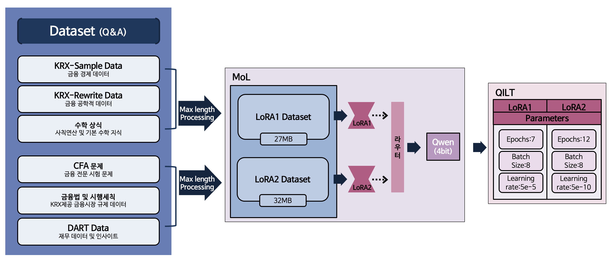
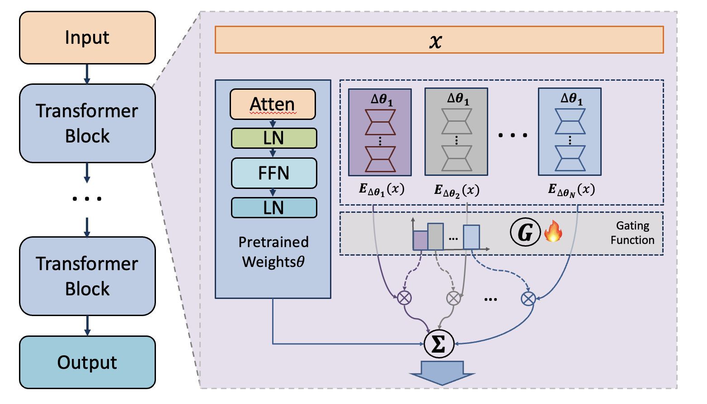

# 학습 데이터 셋

1. 학습 데이터셋 링크
    
    https://drive.google.com/drive/folders/1Lrz662ODkF5nOwLkeObFePDPDzf0lgC7?usp=sharing
    
    https://drive.google.com/drive/folders/1nSAHStpedaGCsO_q_TEd7FiYEOkIQ8CV?usp=sharing
    
2. 데이터셋 구성, 데이터셋의 출처
    a.  amphora/krx-sample-instructions : krx-sample
        
        전반적인 금융, 경제 내용을 담고 있기에 사용하였습니다. 
        
    b. amphora/rewrite-se-quant-alp : krx에서 제공한 rewrite 
        
        블랙숄즈 공식등 다양한 금융 수학적 내용을 담고있기에 사용하였습니다. 
        
    c. DART 기업 공시 데이터: [Dart](https://dart.fss.or.kr/)
        
        본선에 들어오면서 빠졌지만 전반적인 재무데이터와 인사이트를 담고 있어 그대로 사용하였습니다. 
        
   d. 금융 시장 법, 시행세칙 정보: https://law.krx.co.kr/las/main.jsp
        
        KRX에서 제공하는 금융법과 시행세칙 데이터를 담고 있습니다. 
        
    e. 일반적인 수학 상식: https://github.com/tunib-ai/KMWP?tab=readme-ov-file
        
        일반적인 수학 상식 데이터. 
        
        https://creativecommons.org/licenses/by-nc-sa/4.0/deed.ko
        
    f. cfa 문제 https://huggingface.co/datasets/ChanceFocus/flare-cfa
  

| 데이터셋 이름                   | 크기    | 토큰 수 (Approx.) | 형식 | 행 수  |
|-------------------------------|---------|-------------------|------|--------|
| krx-sample-instructions       | 43MB    | 13,156,912        | -    | 25,951 |
| rewrite-se-quant-alp           | 60MB    | 18,326,094        | -    | 21,952 |
| DART 기업 공시 데이터           | 195MB   | 7,551,238         | -    | 69,827 |
| 금융시장 법 및 시행세칙 정보      | 6.16MB  | 203,554           | -    | 1,520  |
| 일반적인 수학상식 데이터          | 6.75MB  | 282,332           | -    | 2,020  |
| CFA 문제 데이터셋                | 14.0MB  | 150,202           | -    | 1,032  |

3. 데이터셋 제작/ 처리/ 검수에 사용된 방법론에 대한 기술(notation은 3번 과 동일함)
    
    ---
    
    **로우 데이터 처리 과정(Q & A 데이터 구성)**
    
    본 연구에서는 다양한 데이터 소스를 활용하여 Q&A 데이터셋을 구성하였습니다. 각 데이터셋별 처리 과정은 다음과 같습니다:
    
    **a,b GPT4o-mini를 활용한 Q&A 데이터셋 생성**
    
    a, b에서 제공된 방법을 그대로 적용하여 GPT4o-mini 모델을 사용해 Q&A 데이터셋을 생성하였습니다. 이 과정에서 모델의 기본 설정을 유지하며, 제공된 데이터의 특성에 맞추어 학습을 진행하였습니다.
    
    **c. DART 기업 공시 데이터를 활용한 국내 기업 정보 수집**
    
    국내 기업에 대한 정확한 정보를 확보하기 위해 DART 기업 공시 데이터를 활용하여 크롤링을 진행하였습니다. 공시 데이터의 팝업 URL이 일정한 형식을 따르고 있음을 확인하고, 이를 기반으로 크롤링 스크립트를 수정하며 데이터 수집을 진행하였습니다. 최종적으로 한 기업당 다음과 같은 정보를 수집하였습니다:
    
    1.	**회사 개요**
    
    •	**처리 방법:** 내용이 존재하지 않는 경우, 표 데이터만 존재하며 해당 표 데이터는 동일한 형식으로 제공됩니다. 따라서 내용이 없는 표 데이터는 일괄적으로 제거하였습니다.
    
    2.	**사업의 내용**
    
    •	**처리 방법:** 모든 기업에 사업 내용이 존재하나, 일부 의미 없는 내용이 포함되어 있습니다. 이를 해결하기 위해 Llama3 모델의 임베딩을 활용하여 데이터를 군집화하였으며, 수작업으로 의미 없는 샘플이 속한 군집을 제거하였습니다.
    
    3.	**경영진단 및 분석의견**
    
    •	**처리 방법:** 내용이 존재하지 않는 데이터는 회사 개요와 동일한 방식으로 처리하여 일괄적으로 제거하였습니다.
    
    **d. KRX 법규 사이트 데이터를 활용한 Q&A 데이터셋 구성**
    
    KRX 법규 사이트에서 제공하는 다양한 법률 정보를 활용하여 Q&A 데이터셋을 구성하였습니다. 특히, Q&A 데이터와 유사성이 높은 업무 규정 데이터를 선택하여 직접 다운로드한 후 텍스트 파일로 변환하였습니다. 법률 데이터는 일정한 형식을 따르고 있었기에 다음과 같은 규칙을 발견하였습니다:
    
    1.	**장 → 조**
    
    •**적용 조건:** 장을 크게 나누지 않고, 바로 세부 규정으로 넘어가야 할 때.
    
    •**예시:** “제1장 총칙” 다음에 “제1조 목적”
    
    2.	**장 → 절 → 조**
    
    •**적용 조건:** 장을 세부적으로 구분해야 할 필요가 있을 때.
    
    •**예시:** “제1장 총칙” 다음에 “제1절 목적과 정의”, 그리고 “제1조 목적”
    
    위의 형식이 일관되게 적용된다는 가정 하에, ‘장’을 기준으로 데이터를 분할하고, 이후 ‘절’과 ‘조’의 관계에 따라 Q&A 데이터를 생성하였습니다.
    
    **e. 기초적인 수학 문제 데이터셋 구성**
    
    GitHub에 공개된 수학 문제 데이터셋에서 코딩 부분과 답변 부분을 결합하여 응답(response) 형태로 데이터셋을 구성하였습니다. 코딩 부분은 문제 해결 과정을 나타낼 수 있는 중요한 요소로 간주하여 제거하지 않고, 응답 부분에 포함시켰습니다. 이를 통해 모델이 수학적 문제 해결 능력을 효과적으로 학습할 수 있도록 하였습니다.
    
    **f. CFA 문제 데이터셋 처리**
    
    CFA(공인 재무 분석가) 문제 데이터는 인증된 협회에서 제공하는 고품질 데이터로 판단되어 활용하였습니다. 해당 데이터를 번역 하였으며, 원본 형식을 유지한 상태로 데이터셋을 구성하였습니다. 이를 통해 모델이 고급 금융 지식과 분석 능력을 학습할 수 있도록 지원하였습니다.

# 학습 방법론

1. 학습에 사용한 코드 링크
2. 하이퍼파라미터 기술(배치크기, 옵치마이저, 양자화 여부, max length, 학습률, 스케줄러)
    
    max_length = 1000, 4bit 양자화, 학습률 5e-5, 
    
3. 학습 중 사용된 방법론에 대한 기술
    
    **도메인 데이터 추가 학습 및 MoL(Mixture of LoRA) 접근법**
    
    도메인 데이터를 통해 추가 학습을 진행할 때, 파괴적 망각(Catastrophic Forgetting)은 모델의 기존 지식을 잃게 만들어 학습의 의미를 상실하게 합니다. LoRA(Low-Rank Adaptation)는 모델의 가중치를 직접적으로 변경하지 않음으로써 파괴적 망각 문제를 회피할 수 있습니다. 그러나 LoRA는 특정 작업에서는 효과적일 수 있으나, 모든 작업에서 최적의 성능을 보장하지는 않습니다. 기존의 거대 언어 모델과 달리 LoRA는 파라미터 수가 크지 않기 때문에 복잡한 패턴을 학습하는 데 한계가 있습니다. 이러한 문제점을 해결하기 위해, 각 도메인에 대해 별도의 LoRA를 생성하여 적용하는 MoL(Mixture of LoRA) 방법이 제안되었습니다.
    
    **도메인 간 지식 괴리 인식 및 데이터셋 분류와 클러스터링 방법**
    
    1. 도메인별 LoRA만들기
    
    저희 팀은 금융 도메인 내에서도 지식에 상당한 괴리가 존재할 것이라고 판단하였습니다. 이는 실제 직관과도 일치하며, 일반적인 경영, 경제, 재무 관련 전문가와 금융수학, 금융공학 관련 전문가 간에는 분명한 지식 범위의 차이가 있을 것입니다. 이러한 직관을 바탕으로, 데이터셋을 다음과 같이 분류하고 수집하였습니다:
    
    •	**경영 및 경제 데이터셋**: 일반적인 경영 이론, 경제 동향, 재무 관리 등.
    
    •	**금융수학 및 금융공학 데이터셋**: 금융 모델링, 수학 등
    
    b. 클러스터링 방법으로 LorA만들기 
    
    위 방법과 달리 직접 데이터셋을 쪼개지 않고 클러스터링 기법을 사용하여 비슷한 데이터들로 묶어 2개의 LoRA를 만들었습니다. (만든 방법은 문서내 데이터셋 참조)
    
    위 두가지 방법모두 사용해 비교분석하는 방법을 사용하였음
    
    **각 하위 그룹에 대한 LoRA 적용**
    
    분류된 하위 그룹별로 각각의 LoRA를 적용하였습니다. 다양한 도메인에 대해 MoL을 제안한 논문에서는 라우터(Router)를 통해 LoRA를 온/오프하는 방식을 사용하였습니다. 저희 팀은 하위 그룹 간에 분명한 차이가 존재함에도 불구하고, 일부 교집합이 있을 것이라고 생각하였습니다. 따라서 각 LoRA가 참조되는 정도를 조정할 수 있도록 모델 구조를 변경하여 완성하였습니다. 구체적으로는 다음과 같은 절차를 따랐습니다:
    
    1.	**데이터셋 분류 및 수집**: 금융 도메인 내의 다양한 하위 그룹을 정의하고, 각 그룹에 맞는 데이터셋을 수집하였습니다.
    
    2.	**개별 LoRA 모델 학습**: 각 하위 그룹별로 별도의 LoRA를 학습시켜 도메인 특화된 지식을 반영하도록 하였습니다.
    
    3.	**MoL 구조 설계**: 하위 그룹 간의 교집합을 고려하여, 각 LoRA가 모델 내에서 참조되는 비율을 조정할 수 있는 메커니즘을 도입하였습니다. 이를 통해 특정 도메인에 특화된 정보와 공통된 정보를 효과적으로 통합할 수 있었습니다.
    
    4.	**모델 통합 및 최적화**: 각 LoRA의 참조 비율을 최적화하여 전체 모델의 성능을 극대화하였습니다.

